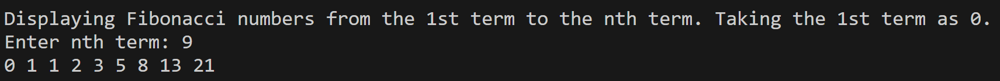

# Fibonacci Sequence

## Name
FiboCalc (Fibonacci Calculator)

## Description
FiboCalc is a Python-based tool designed to simplify and automate the generation of Fibonacci sequences for educational and computational purposes. This project provides a simple interface for calculating the nth term in the Fibonacci sequence, along with options for displaying sequences up to a specified term. The project is ideal for beginners who want to learn more about recursion, input handling, and basic algorithms.

    Features:
    - Calculate the nth term of the Fibonacci sequence.
    - Display the full Fibonacci sequence up to a specified term.
    - Error handling for invalid user inputs.
    - Recursive and iterative implementations.

    Background:
    Fibonacci sequences are a series of numbers where each number is the sum of the two preceding ones, starting from 0 and 1. They have applications in various fields, including mathematics, computer science, and even art.

## Visuals


## Installation
To install and run fiboCalc, follow these steps:

1) Clone the repository:
    ```bash
    git clone https://git.cs.dal.ca/nnadede/fibonacci-sequence.git
    ```
2) Navigate to the project directory:
    ```bash
    cd fibonacci-sequence
    ```
3) Run the Python script:
    ```bash
    python fiboCalc.py
    ```

## Requirements
- Python 3.7 
- No additional dependencies

## Usage
### SAMPLE 1
```bash
Displaying Fibonacci numbers from the 1st term to the nth term. Taking the 1st term as 0.
Enter nth term: -1
Enter nth term greater than 0
```

### SAMPLE 2
```bash
Displaying Fibonacci numbers from the 1st term to the nth term. Taking the 1st term as 0.
Enter nth term: sdcsd
Invalid Value: invalid literal for int() with base 10: 'sdcsd'
```

### SAMPLE 3
```bash
Displaying Fibonacci numbers from the 1st term to the nth term. Taking the 1st term as 0.
Enter nth term: 13
0 1 1 2 3 5 8 13 21 34 55 89 144 
```

## Support
If you encounter any issues, feel free to open an issue on the GitHub Issues page or contact me via email at nn454994@dal.ca.

## Roadmap
- Version 2.0: Add support for custom starting values.
- Version 3.0: Implement a graphical user interface (GUI).
- Version 4.0: Optimize the algorithm for large sequences.

## Contributing
Pull requests are welcome. For major changes, please open an issue first to discuss what you would like to change.

Please make sure to update tests as appropriate.

## Authors and acknowledgment
- Nnaemeka Nnadede - _Initial work_ - [@nnadede](https://git.cs.dal.ca/nnadede)
- Special thanks to all contributors and reviewers!

## License
[MIT](LICENSE)

## Project status
Active Development - The project is actively maintained and open to new contributors. However, if you are interested in becoming a maintainer, please reach out!
